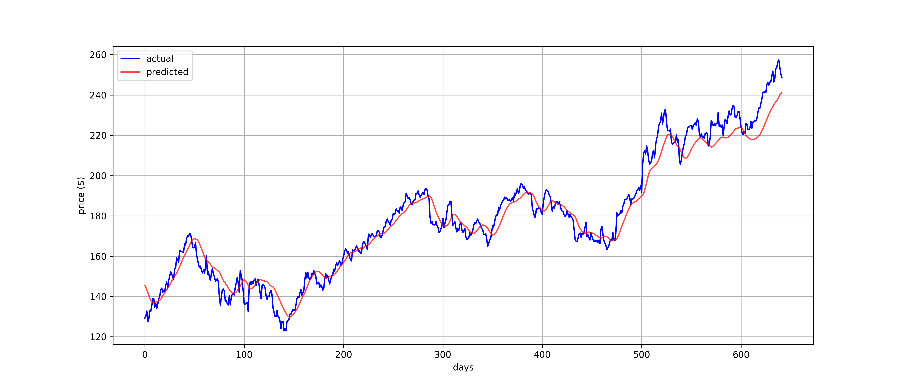
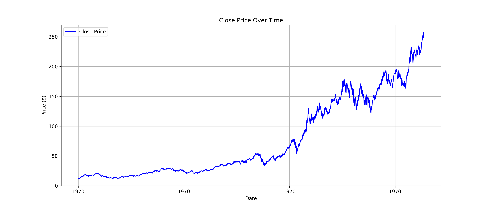
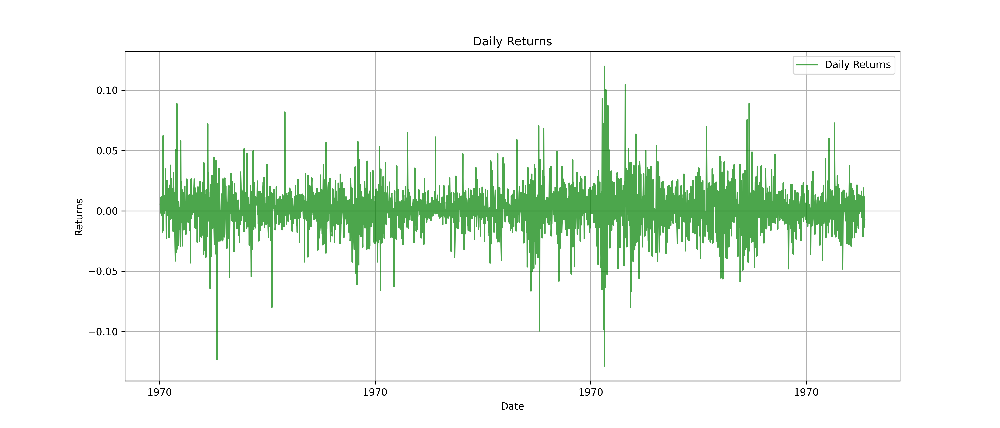

# Stock Price Prediction with LSTM

Прогнозирование цен акций Apple (AAPL) с использованием рекуррентной нейронной сети LSTM.

## Данные

Исторические данные о ценах акций Apple (AAPL) за период с 2012 по 2025 год. Использована цена закрытия (Close) для обучения модели.

- **Источник:** Yahoo Finance (yfinance)
- **Период:** 2012–2025
- **Количество записей:** 3272
- **Целевая переменная:** цена закрытия

## Методология

### Предобработка данных
- Масштабирование значений в диапазон [0, 1] с помощью MinMaxScaler
- Создание последовательностей длиной 60 дней для предсказания следующего дня
- Разделение на обучающую (80%) и тестовую (20%) выборки

### Архитектура модели
- Два слоя LSTM (по 50 нейронов)
- Dropout (0.2) для предотвращения переобучения
- Плотный слой (1 нейрон) для предсказания
- Оптимизатор: Adam
- Функция потерь: MSE

## Результаты

Метрики качества на тестовой выборке:
- **MAE:** $5.35
- **RMSE:** $6.83

График предсказаний модели (красный) на фоне реальных цен (синий):



Динамика изменения цены закрытия за весь период:



Ежедневная волатильность (дневные изменения цены):



## Запуск

```bash
pip install -r requirements.txt

python src/generate_data.py - необязательно
python src/preprocess.py - необязательно
python src/train.py
python src/visualize.py